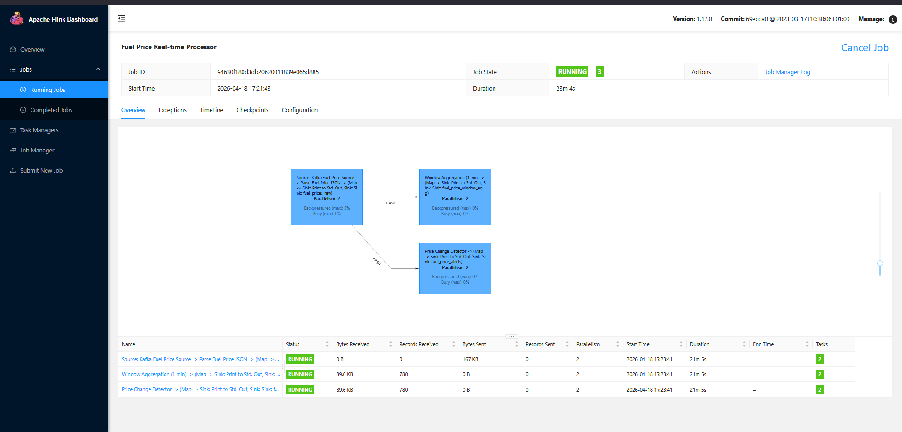

# Real-time Global Oil Price Monitor

## 📋 Yêu cầu hệ thống
- **OS:** Ubuntu 22.04 LTS (hoặc Windows 10/11 + Docker Desktop)
- **Java:** 11+
- **Maven:** 3.6.3+
- **Docker:** 20.10+ (Docker Desktop hoặc Docker Engine)
- **Git:** để clone repo

## 🚀 Cài đặt nhanh (với Docker Compose)

### Bước 1: Clone project
```bash
git clone https://github.com/mtoanng/Real-time-processing-with-Kafka-Flink-Postgres.git
cd Project
```

### Bước 2: Start toàn bộ stack
```bash
docker-compose up -d
```
→ Tự động khởi động: Zookeeper, Kafka, Flink (JobManager + TaskManager), PostgreSQL, Metabase

Kiểm tra bằng:
```bash
docker-compose ps
# Sẽ hiển thị 6 services: zookeeper, kafka, flink-jobmanager, flink-taskmanager, postgres-database, metabase
```

### Bước 3: Build producer
```bash
cd KafkaProducer/FuelPriceProducer
mvn clean package -DskipTests
```

### Bước 4: Build Flink consumer
```bash
cd Project/KafkaConsumer
mvn clean package -DskipTests
```

### Bước 5: Submit Flink job
```bash
# Build Consumer
cd Project/KafkaConsumer
mvn clean package -DskipTests

# Copy JAR vào Flink container
docker cp target/KafkaConsumer-v1.1.1.jar flink-jobmanager:/job.jar

# Submit job
docker exec flink-jobmanager flink run \
  -c org.cloud.KafkaConsumerApplication /job.jar
```

**Quan trọng:** Consumer dùng Docker service names:
- Kafka: `kafka:29092` (internal Docker bootstrap)
- PostgreSQL: `postgres-database:5432` (Docker service name)

Configured in `src/main/resources/application.properties`

### Bước 6: Start producer
```bash
cd Project/KafkaProducer/FuelPriceProducer
java -jar target/FuelPriceProducer-1.0.0.jar
```

### Bước 7: Kiểm tra State của các Services
#### Check Kafka messages
```bash
docker exec -it kafka kafka-console-consumer \
  --bootstrap-server localhost:9092 \
  --topic fuel-prices \
  --from-beginning \
  --max-messages 10
```
#### Monitor PostgreSQL (raw data)
```bash
docker exec -it postgres-database psql -U postgres -d fuel_prices -c \
  "SELECT COUNT(*) as total_records FROM fuel_prices_raw;"
```
### Check Flink job 's status (http://localhost:8081
)


#### Monitor PostgreSQL (aggregated data) - after ~1 minute
```bash
docker exec -it postgres-database psql -U postgres -d fuel_prices -c \
  "SELECT COUNT(*) as aggregated_records FROM fuel_price_window_agg;"
```

### Bước 8: Metabase dashboard
- Vào http://localhost:3000
- Setup: Database Host = `postgres` (tên service Docker), Port = 5432, User = `postgres`, Pass = `123456`, DB = `fuel_prices`

---

## 📦 Chi tiết từng component

### Kafka (Port 9092)
**Topics:**
- `fuel-prices` → Raw feed từ producer (30 records/10 giây)

**Commands:**
```bash
# List topics
docker exec kafka kafka-topics --list --bootstrap-server localhost:9092

# View messages
docker exec -it kafka kafka-console-consumer \
  --bootstrap-server localhost:9092 \
  --topic fuel-prices --from-beginning --max-messages 5

# Create topic (if needed)
docker exec kafka kafka-topics --create \
  --bootstrap-server localhost:9092 \
  --topic fuel-prices \
  --partitions 3 --replication-factor 1
```

### Flink (Port 8081)
**Dashboard:** http://localhost:8081

**Job:** Fuel Price Stream Processor
- 3 parallel tasks: 
  1. Parse JSON
  2. Aggregate (1-min window)
  3. Detect alerts (> 5% change)

**Outputs:**
- `fuel_prices_raw` table
- `fuel_price_window_agg` table
- `fuel_price_alerts` table

### PostgreSQL (Port 5432)
**Database:** fuel_prices  
**User:** postgres  
**Password:** 123456

**Tables:**
```bash
docker exec -it postgres psql -U postgres -d fuel_prices

\dt                          # List tables
SELECT * FROM fuel_prices_raw LIMIT 5;
SELECT * FROM fuel_price_window_agg LIMIT 5;
SELECT * FROM fuel_price_alerts LIMIT 5;
```

### Metabase (Port 3000)
**URL:** http://localhost:3000  
**Default:** Setup wizard trên lần đầu

**Dashboard:** "Global Oil Price Monitor"
- 5 cards: Current Prices, WTI Chart, WTI vs Brent, Volatility, Alerts
- Auto-refresh: 1 minute

---

## ⚡ Troubleshooting

### Kafka connection refused
```bash
docker logs kafka
docker restart kafka
# Chờ 30s, thử lại
```

### Flink job failed
```bash
docker logs flink-jobmanager
docker logs flink-taskmanager
# Check pom.xml shade plugin config
```

### PostgreSQL tables not found
```bash
# Verify init script ran
docker logs postgres

# Manually run SQL
docker exec -it postgres psql -U postgres -d fuel_prices \
  -f /docker-entrypoint-initdb.d/init_fuel_schema.sql
```

### Metabase can't connect DB
- **Wrong:** Host = `localhost`
- **Correct:** Host = `postgres` (tên service Docker)

### No data in tables
```bash
# Check producer running
ps aux | grep FuelPriceProducer

# Check Flink job status
# → http://localhost:8081 → Jobs → Running Jobs

# Check Flink logs
docker logs flink-taskmanager
```

### Flink can't connect to PostgreSQL (Connection refused)
**Cause:** Using `localhost:5432` instead of Docker service name  
**Fix:** Application properties must use Docker service names:
```properties
# WRONG:
jdbc.url=jdbc:postgresql://localhost:5432/fuel_prices
kafka.bootstrap.servers=localhost:9092

# CORRECT:
jdbc.url=jdbc:postgresql://postgres-database:5432/fuel_prices
kafka.bootstrap.servers=kafka:29092
```

Rebuild and redeploy the Flink job after fixing:
```bash
mvn clean package -DskipTests
docker cp target/KafkaConsumer-v1.1.1-shaded.jar flink-jobmanager:/job.jar
docker exec flink-jobmanager flink run -c org.cloud.KafkaConsumerApplication /job.jar
```

---

## 📚 Tài liệu quan trọng

| File | Mục đích |
|---|---|
| `Project/PHAN_CONG_CONG_VIEC.md` | Phân công chi tiết cho từng thành viên |
| `Project/docker-compose.yml` | Config stack |
| `Project/script/init_fuel_schema.sql` | PostgreSQL schema |
| `Project/script/metabase_queries.sql` | Queries cho Metabase |
| `Project/script/presentation_script.md` | Script thuyết trình |

---

## 🧪 Test toàn hệ thống

**Kiểm tra từng phần:**
```bash
# 1. Docker services
docker-compose ps

# 2. Kafka topic
docker exec kafka kafka-topics --list --bootstrap-server localhost:9092

# 3. Flink UI
curl -s http://localhost:8081/overview | grep -o "flink-web-ui"

# 4. PostgreSQL
docker exec postgres psql -U postgres -d fuel_prices -c "SELECT COUNT(*) FROM fuel_prices_raw;"

# 5. Metabase
curl -s http://localhost:3000 | grep -o "Metabase"
```

**End-to-end test (5 phút):**
```bash
# Terminal 1: Start producer
cd Project/KafkaProducer/FuelPriceProducer
java -jar target/FuelPriceProducer-1.0-SNAPSHOT.jar

# Terminal 2: Monitor Postgres
watch 'docker exec postgres psql -U postgres -d fuel_prices -c "SELECT COUNT(*) FROM fuel_prices_raw; SELECT COUNT(*) FROM fuel_price_window_agg; SELECT COUNT(*) FROM fuel_price_alerts;"'

# Terminal 3: View Metabase
# http://localhost:3000
```

## 🔄 Git Commit & Push (After Testing)

**Files to commit (already fixed):**
```bash
git add Project/docker-compose.yml  # Flink services added
git add Project/KafkaConsumer/src/main/resources/application.properties  # Docker service names fixed
git add Cloud.md  # Updated guide
git commit -m "fix: Add Flink containers to Docker Compose & fix Docker service names for Kafka/PostgreSQL connection"
git push origin main
```

**Teammates** - After pulling, just run:
```bash
cd Project
docker-compose up -d
cd KafkaConsumer && mvn clean package -DskipTests && cd ..
docker cp KafkaConsumer/target/KafkaConsumer-v*.jar flink-jobmanager:/job.jar
docker exec flink-jobmanager flink run -c org.cloud.KafkaConsumerApplication /job.jar
cd KafkaProducer/FuelPriceProducer && java -jar target/FuelPriceProducer-1.0.0.jar
```

---

**Cập nhật lần cuối:** Tháng 4/2026
- Khởi tạo trực tiếp:
  - Truy cập thư mục **KafkaProducer**.
  - Thực hiện `python3 ProducerHN.py`, `python3 ProducerHCM.py` với 2 chi nhánh để đưa dữ liệu lên Kafka.
- Chạy với `Dockerfile`, đóng gói và triển khai với 10 producer chạy song song cho 10 chi nhánh cùng tải dữ liệu lên Kafka.


## Khởi chạy Kafka Consumer
- Truy cập thư  mục **KafkaConsumer** theo công việc, vào file `pom.xml` chỉnh sửa version mới và thực hiện `mvn clean package` để tạo ra file `.jar` mới, file sẽ nằm trong folder `target`.
- Truy cập thư mục lưu trữ **flink** và thực hiện `./bin/flink run -c org.cloud.KafkaConsumerApplication ~/Deploy/KafkaConsumer-v1.0.0.jar` (Thay bằng đường dẫn và phiên bản phù hợp).
- Xem thông tin cấu hình, chi tiết hoạt động các job xử lý dữ liệu trên dashboard của Flink.