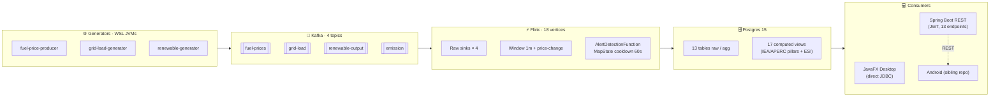

# ⚡ VES-Monitor — Vietnam Energy Security Real-time Platform

[]()
[]()
[]()
[]()
[]()
[]()
[]()
[]()
[]()
[]()

> **Real-time distributed platform for monitoring Vietnam's energy security** along the 4 IEA / APERC pillars (Supply Security · Market Resilience · Grid Reliability · Energy Transition). Ingests fuel prices, grid load, renewable output, and CO₂ emissions via **Kafka + Flink**, surfaces alerts and recommendations through a **Spring Boot REST API** and a **JavaFX admin desktop**.
>
> **Nền tảng giám sát an ninh năng lượng Việt Nam thời gian thực** theo 4 trụ cột chuẩn IEA / APERC. Pipeline phân tán Kafka → Flink → Postgres, kèm REST API cho mobile/external và JavaFX desktop admin cho vận hành.

---

## 🚀 Quickstart — clone & run in 5 minutes

> Setup: Windows 11 + WSL 2 (Ubuntu 22.04) + Docker Desktop + JDK 17 + Maven 3.9+. Tested on a clean machine end-to-end.

```powershell
# 1) Clone (PowerShell)
git clone https://github.com/mtoanng/Real-time-processing-with-Kafka-Flink-Postgres.git
cd Real-time-processing-with-Kafka-Flink-Postgres

# 2) Bring up Docker stack — 5 services, ~1.6 GB RAM (WSL)
wsl -d Ubuntu-22.04 bash -lc 'bash scripts/run.sh --wait'

# 3) Build all Maven modules — ~60s warm cache (PowerShell)
mvn -q clean package -DskipTests

# 4) Submit Flink job via UI (browser, ~10s)
#    → http://localhost:8081 → "Submit New Job" → upload flink-jobs/fuel-flink-job/target/fuel-flink-job-1.1.1.jar
#    → entry class: org.cloud.KafkaConsumerApplication → "Submit"

# 5) Start 3 generators in background (WSL)
wsl -d Ubuntu-22.04 bash -lc 'bash scripts/_phase4_start_generators.sh'

# 6) Launch backend REST API (PowerShell, separate window)
Start-Process java -ArgumentList '-jar','backend-api\target\ves-backend-api.jar' -RedirectStandardOutput 'build-logs\backend-run.log'

# 7) Launch JavaFX desktop (PowerShell)
mvn -pl desktop-admin javafx:run
#    → Login: admin / admin
```

After ~60 s all services are healthy and 4 pillars of data are flowing:

| Service | URL | Notes |
|---|---|---|
| Flink UI | http://localhost:8081 | 18/18 vertices RUNNING |
| Swagger UI | http://localhost:8090/swagger-ui.html | 13 endpoints |
| Backend health | http://localhost:8090/api/health | `{"status":"UP","db":"UP"}` |
| Metabase (optional BI) | http://localhost:3000 | overlay dashboards |
| PostgreSQL | `localhost:5432` | user `postgres` / pwd `123456` / db `fuel_prices` |
| Kafka | `localhost:9092` | 4 topics, 3 partitions each |

**Smoke verify**: `wsl -d Ubuntu-22.04 bash -lc 'bash scripts/healthcheck.sh'` → expect 4/4 OK.

**Shutdown**: `wsl -d Ubuntu-22.04 bash -lc 'bash scripts/stop_generators.sh && bash scripts/stop.sh'`.

---

## 🏗️ Architecture

End-to-end data flow — **4 generators → 4 Kafka topics → 1 Flink job (18 vertices) → 13 Postgres tables + 17 views → 3 consumers**. Full diagram + measured throughput in [`docs/diagrams/01_dataflow.md`](./docs/diagrams/01_dataflow.md).



> 4 detailed diagrams (data flow / ERD / class / pillar framework) in [`docs/diagrams/`](./docs/diagrams/).

---

## 📦 Tech stack

| Tier | Component | Version | Module |
|---|---|---|---|
| Data sources | Java Kafka producers × 3 (1 multi-topic) | OpenJDK 11 | `data-generators/{fuel-price-producer,grid-load-generator,renewable-generator}` |
| Message broker | Apache Kafka | 7.5.0 | `infra/docker-compose.yml` |
| Stream processor | Apache Flink | 1.17.0 | `flink-jobs/fuel-flink-job` |
| Storage | PostgreSQL | 15 | `infra/script/*.sql` |
| Backend | Spring Boot + JdbcTemplate | 2.7.18 | `backend-api/` |
| Auth | jjwt (JWT HS256) | 0.11.5 | `backend-api/.../config/Jwt*` |
| Desktop UI | JavaFX (controls + fxml + web) | 17.0.10 LTS | `desktop-admin/` |
| Test framework | JUnit 4 + Mockito + H2 (in-memory) | 4.13.2 / 5.7.0 / 2.2.224 | all modules |
| Build | Maven multi-module | 3.9.6 | parent `pom.xml` |
| Containerisation | Docker Compose | v2 | `infra/docker-compose.yml` |
| BI (optional) | Metabase | 0.47 | overlay in docker-compose |

---

## ✨ Features highlight

### 🛡️ 4-pillar IEA / APERC energy security framework

- **P1 Supply Security** (weight 0.30) — IDR · SFRI · HHI · N-1 resilience
- **P2 Market Resilience** (weight 0.20) — σ_30d · price_gap · β_crude · affordability
- **P3 Grid Reliability** (weight 0.30) — reserve margin · peak factor · shedding prob · freq stability
- **P4 Energy Transition** (weight 0.20) — renewable % · CO₂ intensity · curtailment · netzero progress
- **Composite ESI** = `0.30·P1 + 0.20·P2 + 0.30·P3 + 0.20·P4` · status SECURE/ELEVATED/STRESSED/CRITICAL

> Full taxonomy + formulas + reference standards: [`docs/diagrams/04_pillar_framework.md`](./docs/diagrams/04_pillar_framework.md).

### ⚡ Real-time pipeline highlights

- **Flink `KeyedProcessFunction` + `MapState` cooldown 60 s** → no alert storms when metrics oscillate around thresholds
- **SQL `NOT EXISTS` 30 min dedup** for auto-recommendations → at most 1 action_type per pillar/region per 30 min
- **17 computed views** → change business logic via `psql -f`, no Flink job redeploy
- Measured throughput: **~ 1 000 events/sec aggregate** (verified live, see [`docs/DEMO_RUN_LOG.md`](./docs/DEMO_RUN_LOG.md))

### 🖥️ JavaFX desktop admin (5 tabs)

| Tab | Highlights |
|---|---|
| **Pillar 1 · Supply Security** | Table IDR/SFRI/HHI/N-1 · sparkline · pulse on CRITICAL |
| **Pillar 2 · Market Resilience** | σ_30d / price_gap / β_crude / affordability + line chart |
| **Pillar 3 · Grid Reliability** | reserve margin · shedding prob · BarChart colored by load_pct |
| **Pillar 4 · Energy Transition** | renewable % / CO₂ intensity · pie chart fuel mix |
| **Maps · Bản đồ** | VN SVG 3-zone clickable drill-down · Leaflet world map with 7 fuel hubs |

Top bar: **live ticker `⚡ N events/sec`** (Flink REST + EMA) · **ESI gauge** · 4 nav buttons.
Right sidebar: **recommendations list** with severity-colored cells + fade-in for new rows + slide-in toast for CRITICAL.

> Screenshots: TODO — capture `01_dashboard.png`, `02_maps_vn.png`, `03_maps_world.png`, `04_critical_toast.png` and commit under `docs/screenshots/`.

### 🌐 Backend REST API (Spring Boot 2.7)

JWT-secured, JdbcTemplate, Springdoc OpenAPI — 13 endpoints listed in the **API quick reference** below.

---

## 🌐 API quick reference

| Method | Path | Pillar | Description |
|---|---|---|---|
| `POST` | `/api/auth/login`                 | – | Issue JWT (admin/admin, manager/manager, user/user — seed users) |
| `GET`  | `/api/auth/me`                    | – | Current user info |
| `GET`  | `/api/pillars/1/supply-security`  | 1 | IDR · SFRI · HHI · N-1 (Phase 7.1) |
| `GET`  | `/api/pillars/2/market-resilience`| 2 | σ_30d · price_gap · β_crude · affordability |
| `GET`  | `/api/pillars/3/grid-reliability` | 3 | reserve margin · peak factor · shedding prob · freq stability |
| `GET`  | `/api/pillars/4/energy-transition`| 4 | renewable % · CO₂ intensity · curtailment · netzero progress |
| `GET`  | `/api/security/score`             | 0 | Composite ESI 0-100 + status |
| `GET`  | `/api/security/cascade-risks`     | 0 | Compound multi-pillar risks (FUEL_SHORTAGE / GENERATION_DEFICIT / CARBON_COST) |
| `GET`  | `/api/recommendations`            | 0 | PENDING recommendation list with age |
| `POST` | `/api/recommendations/{id}/acknowledge` | 0 | ACK / DISMISS with audit user + note |
| `GET`  | `/api/alerts/active`              | all | Unacknowledged alerts (multi-pillar) |
| `GET`  | `/api/fuel-prices/latest`         | 2 | N most recent fuel prices |
| `GET`  | `/api/grid-load/latest`           | 3 | Latest load per region |
| `GET`  | `/api/health`                     | – | DB ping (public, used by tunnel probe) |

- **Swagger UI**: http://localhost:8090/swagger-ui.html
- **Postman collection**: [`docs/VES-Monitor.postman_collection.json`](./docs/VES-Monitor.postman_collection.json) — 8 folders / 19 requests (auto-`{{token}}` script on `Auth/Login`)
- **OpenAPI spec (raw)**: [`docs/openapi.json`](./docs/openapi.json) — 20 paths (13 canonical + 6 legacy aliases + 1 acknowledge sub-path)

> ✅ Phase 7.6 (post-tag `v1.0.0` @ `e64d447`): the 5 endpoints flagged at tag time (`/api/pillars/*` + `/api/security/cascade-risks`) have been migrated to the new IEA-APERC view schema. 13 / 13 REST endpoints return `200 OK` on `origin/main`; legacy paths are kept as backward-compat aliases. See [`docs/RELEASE_NOTES.md`](./docs/RELEASE_NOTES.md#-post-release-fixes).

---

## 🛡️ 4-pillar framework summary

| # | Pillar (EN · VI) | Weight | IEA / APERC reference | View |
|---|---|---:|---|---|
| 1 | **Supply Security · An ninh nguồn cung** | 0.30 | IEA + APERC #1, #7 | `v_pillar1_supply_security` |
| 2 | **Market Resilience · Khả năng chịu giá** | 0.20 | IEA + IMF Volatility | `v_pillar2_market_resilience` |
| 3 | **Grid Reliability · Độ tin cậy lưới điện** | 0.30 | NERC + IEEE 1366 | `v_pillar3_grid_reliability` |
| 4 | **Energy Transition · Chuyển dịch năng lượng** | 0.20 | IPCC AR6 + Net-Zero 2050 | `v_pillar4_energy_transition` |

**Composite Energy Security Index** (`v_security_score`):
```
ESI = 0.30·P1 + 0.20·P2 + 0.30·P3 + 0.20·P4
Status: SECURE ≥80 · ELEVATED 60-79 · STRESSED 40-59 · CRITICAL <40
```

> Full sub-indicator formulas + reference standards: [`docs/diagrams/04_pillar_framework.md`](./docs/diagrams/04_pillar_framework.md). SQL views: [`infra/script/08_pillars_v2.sql`](./infra/script/08_pillars_v2.sql).

---

## 🎨 Design patterns inventory

10 GoF / enterprise patterns demonstrated in `desktop-admin/`. Class diagram + relationships: [`docs/diagrams/03_class_desktop.md`](./docs/diagrams/03_class_desktop.md).

| # | Pattern | Location |
|---|---|---|
| 1 | **Singleton** | `DatabaseConfig`, `SessionManager`, `MainApp` |
| 2 | **DAO** | `UserDao`, `RegionDao`, `AlertRuleDao`, `ViewsDao` (extend `BaseDao`) |
| 3 | **MVC** | 6 FXML × 6 Controllers × 13 Model POJOs |
| 4 | **Strategy** | `Validator` interface + `NotBlank/LengthRange/Pattern/InSet` strategies |
| 5 | **Composite** | `Validator.compose(v1, v2, ...)` fan-out collector |
| 6 | **Factory** | `DatabaseConfig.openConnection()` |
| 7 | **Service Layer / Facade** | All `*ServiceImpl` classes |
| 8 | **Observer** | `LiveMetricsService` `ScheduledExecutorService` callback |
| 9 | **Adapter** | `FlinkClient` wraps Flink REST JSON to a single Java method |
| 10 | **Template Method** | `BaseDao` shared null-handling helpers |

---

## ✅ Testing

```powershell
# Run all desktop tests (77/77 PASS, ~18 s)
mvn -pl desktop-admin test

# Run backend tests
mvn -pl backend-api test

# Package both
mvn clean package -DskipTests
```

| Module | Test type | Count | Runtime |
|---|---|---:|---:|
| `desktop-admin` | DAO integration (H2 in-memory `MODE=PostgreSQL`) | 24 | — |
| `desktop-admin` | Service unit (Mockito mock DAO) | 22 | — |
| `desktop-admin` | Util unit (PasswordUtil, SessionManager, Validator) | 16 | — |
| `desktop-admin` | Widget / Flink client (embedded HttpServer) | 15 | — |
| **`desktop-admin` total** | | **77 / 77 PASS** | **~18 s** |
| `backend-api` | `@WebMvcTest` smoke (8 pillar + 3 security) | **11 / 11 PASS** | ~9 s |
| **All-module total** | | **88 / 88 PASS** | |

Lint: clean across all 4 modules. FXML XML parse: 6/6 valid.

---

## 📁 Project structure

```
Real-time-processing-with-Kafka-Flink-Postgres/
├── infra/                              # Docker + SQL init scripts
│   ├── docker-compose.yml              # 5-service Lite stack
│   └── script/                         # 9 init SQL files (load in order)
│       ├── 01_init_fuel_schema.sql     # Pillar 2 base (existing)
│       ├── 02_init_users_regions.sql   # users + regions (Phase 2)
│       ├── 03_init_alerts.sql          # alert_rules + alerts (Phase 2)
│       ├── 04_seed_basic.sql           # seed 3 users + 6 regions + 5 rules
│       ├── 05_init_pillars.sql         # Pillar 1/3/4 raw tables (Phase 2.5)
│       ├── 06_seed_pillars.sql         # inventory seed
│       ├── 07_init_security_features.sql # alert_rules multi-pillar + recs + 8 action views (Phase 2.6)
│       ├── 08_pillars_v2.sql           # IEA/APERC redesign + composite ESI (Phase 7.1)
│       └── 09_alter_alerts_multi_pillar.sql # alerts metric_type column (Phase 4)
│
├── data-generators/
│   ├── fuel-price-producer/            # 30 rec/10s → fuel-prices topic
│   ├── grid-load-generator/            # 3 region × 5s → grid-load topic
│   └── renewable-generator/            # 9 rec/10s → renewable-output + 3/30s → emission
│
├── flink-jobs/
│   └── fuel-flink-job/                 # 4 source × 18 vertex; AlertDetectionFunction with MapState cooldown
│
├── backend-api/                        # Spring Boot 2.7 REST API (13 endpoints, JWT, Springdoc)
│   ├── pom.xml
│   ├── README.md                       # Build / run / proxy workaround
│   └── src/main/java/vn/edu/ves/api/
│       ├── controller/                 # 7 controllers
│       ├── dao/                        # 5 JdbcTemplate DAOs
│       ├── dto/                        # 13 DTOs
│       ├── config/                     # SecurityConfig, JwtTokenProvider, JwtAuthFilter, OpenApiConfig
│       └── exception/                  # GlobalExceptionHandler + ApiException
│
├── desktop-admin/                      # JavaFX 17 admin desktop (5 screens, 77 tests)
│   ├── pom.xml
│   ├── README.md
│   └── src/main/java/vn/edu/ves/desktop/
│       ├── MainApp.java                # JavaFX entry
│       ├── controller/                 # 6 controllers (Login, Dashboard, Region, AlertRule, User, Maps)
│       ├── service/                    # 6 services (Auth, Dashboard, Region, AlertRule, User, LiveMetrics)
│       ├── dao/                        # 4 DAOs + BaseDao
│       ├── model/                      # 13 POJO models
│       ├── util/                       # DatabaseConfig, SessionManager, PasswordUtil, Validator, FlinkClient, AlertHelper
│       ├── widget/                     # Sparkline, PulseEffect, Toast, VietnamMap, WorldMapView
│       └── exception/                  # AuthenticationException
│
├── scripts/                            # One-click bootstrap + helpers
│   ├── run.sh / run.ps1                # Bring up Docker stack + pre-create topics
│   ├── stop.sh / stop.ps1
│   ├── healthcheck.sh                  # 4-check verify
│   ├── _phase4_start_generators.sh     # Launch 3 generators in background
│   └── phase45_smoke_api.sh            # 14-endpoint REST smoke
│
├── docs/                               # 📚 Documentation (this folder)
│   ├── PROGRESS.md                     # Phase tracking + verification log
│   ├── DEMO_RUN_LOG.md                 # E2E runtime verification (live snapshot)
│   ├── DEMO_SCRIPT.md                  # 18-min copy-paste demo runbook
│   ├── SLIDES_OUTLINE.md               # 15-slide presenter outline
│   ├── RELEASE_NOTES.md                # v1.0.0 release notes
│   ├── SUBMISSION_PACKAGE.md           # Artifact manifest for graders
│   ├── TEAM_TASKS.md                   # 5-person team work breakdown
│   ├── ANDROID_ONBOARDING.md           # Android sibling project onboarding
│   ├── PROXY_SETUP.md                  # Bosch NTLM proxy workaround
│   ├── MAVEN_SETUP.md                  # Portable Maven install guide
│   ├── openapi.json                    # OpenAPI 3 spec
│   ├── VES-Monitor.postman_collection.json
│   └── diagrams/                       # 4 Mermaid diagrams + index README
│
├── pom.xml                             # Parent Maven (multi-module)
├── UPGRADE_PLAN.md                     # Detailed upgrade plan (§24 = execution roadmap)
├── JAVA_FINAL_PROJECT_REQUIREMENT.md   # Course requirement (Java)
├── .env.example
├── .gitignore
├── .gitattributes
└── README.md                           # ← you are here
```

---

## 🗓️ Phase history

Full milestone-by-milestone log + verification snapshots: [`docs/PROGRESS.md`](./docs/PROGRESS.md).

| Phase | Highlight | Tag |
|---|---|---|
| 0 → 2.6 | Foundation · Docker Lite · 4-pillar schema · 8 action views | `v0.0` → `v0.2.6` |
| 3 → 4 | Flink alert engine · 4-pillar Flink job (18 vertex) · auto-recommendation | `v0.3` · `v0.4` |
| 4.5 | Spring Boot REST API · 13 endpoints · JWT · Swagger | code-complete |
| 5.0 → 5.5 | JavaFX desktop 5 screens · 77 tests · 10 design patterns | code-complete |
| 6 | Android split into sibling repo [`mtoanng/DataStream`](https://github.com/mtoanng/DataStream) | (separate) |
| 7.0 → 7.5 | DB sync · IEA/APERC redesign · live ticker / sparklines / pulse / toast · interactive maps · QA pass | live-verified |
| **7.7** | **Submission documentation pack** (this README · diagrams · slides · demo script · release notes) | **`v1.0.0`** |

---

## 👥 Team

This is a 5-person final project for **IS402.P21 — Java + Mobile App Development** (UIT-VNUHCM).

- Work breakdown structure (5 PR-step format): [`docs/TEAM_TASKS.md`](./docs/TEAM_TASKS.md)
- Member B/C/D/E roles: see TEAM_TASKS for owners, deliverables, and review checklists
- Communication: GitHub issues + Slack
- Code review: 2-approvals on `main` enforced via branch protection (when GitHub Pro enabled)

---

## 📱 Android sibling repo

The Android mobile client is a **separate course project** with its own independent repository:

🔗 **[`mtoanng/DataStream`](https://github.com/mtoanng/DataStream)**

- 4-screen bottom-nav (1 per pillar)
- Retrofit2 + MPAndroidChart
- Consumes only the 13 REST endpoints from this repo's `backend-api/`
- Onboarding doc for Android dev: [`docs/ANDROID_ONBOARDING.md`](./docs/ANDROID_ONBOARDING.md)

> Why split? Different course, different language (Kotlin vs Java), different CI / release cadence. Keeping it as a sibling repo respects both projects' boundaries.

---

## 🐛 Troubleshooting

| Symptom | Fix |
|---|---|
| Kafka `connection refused` | `docker logs kafka` → wait 30 s, or `bash scripts/stop.sh --volumes && bash scripts/run.sh` |
| Flink job FAILED | Check `docker logs flink-jobmanager`; verify JAR shade classpath; re-submit |
| Postgres table not found | `docker logs postgres-database | grep init_fuel_schema` — verify init scripts ran |
| Port 5432 / 9092 / 8081 / 8090 in use | Edit `.env` (Docker) or `SERVER_PORT` (backend-api) |
| `mvn package` 407 Proxy NTLM (Bosch network) | See [`docs/PROXY_SETUP.md`](./docs/PROXY_SETUP.md) — use cntlm bridge or hotspot |
| JavaFX won't start | Verify JDK 17+ and `mvn javafx:run` cmd vs cli `java -jar` (need module path); see [`desktop-admin/README.md`](./desktop-admin/README.md) |
| Leaflet world map offline overlay | Expected behavior when Bosch firewall blocks unpkg + OSM tile CDN; falls back to text hub list |

More: [`docs/PROXY_SETUP.md`](./docs/PROXY_SETUP.md) · [`docs/MAVEN_SETUP.md`](./docs/MAVEN_SETUP.md) · [`backend-api/README.md`](./backend-api/README.md) · [`desktop-admin/README.md`](./desktop-admin/README.md).

---

## 📚 Further documentation

| File | Content |
|---|---|
| [`UPGRADE_PLAN.md`](./UPGRADE_PLAN.md) | Original upgrade plan, §24 = minimal-execution roadmap |
| [`JAVA_FINAL_PROJECT_REQUIREMENT.md`](./JAVA_FINAL_PROJECT_REQUIREMENT.md) | Course requirements (Java module) |
| [`docs/PROGRESS.md`](./docs/PROGRESS.md) | Phase-by-phase log + verification snapshots |
| [`docs/DEMO_RUN_LOG.md`](./docs/DEMO_RUN_LOG.md) | E2E live runtime verification |
| [`docs/DEMO_SCRIPT.md`](./docs/DEMO_SCRIPT.md) | 18-minute copy-paste demo runbook |
| [`docs/SLIDES_OUTLINE.md`](./docs/SLIDES_OUTLINE.md) | 15-slide presenter outline (~18 min) |
| [`docs/RELEASE_NOTES.md`](./docs/RELEASE_NOTES.md) | v1.0.0 release notes |
| [`docs/SUBMISSION_PACKAGE.md`](./docs/SUBMISSION_PACKAGE.md) | Grader artifact manifest |
| [`docs/diagrams/`](./docs/diagrams/) | 4 Mermaid diagrams + export instructions |

---

## 📜 License & contributors

**License**: Educational / academic use only — IS402.P21 final project, UIT-VNUHCM 2026.

**Course**: IS402.P21 · Java Programming · Mobile App Development.

**Contributors**: see [`docs/TEAM_TASKS.md`](./docs/TEAM_TASKS.md). Pull requests welcome on a fork; this repo is read-only after `v1.0.0` tag.

---

> 💡 **Want to reproduce results?** Check [`docs/DEMO_RUN_LOG.md`](./docs/DEMO_RUN_LOG.md) for the verified live snapshot on `HEAD = 30265f1` — 18 Flink vertices RUNNING, 4 topics flowing, ESI 72.82 ELEVATED. Tag `v1.0.0` freezes that state.
