# 🏎️ F1 Live Telemetry Streaming Platform

[]()
[]()
[]()
[]()
[]()
[]()
[]()
[]()

> **Real-time streaming platform replaying authentic F1 telemetry data** from the 2025 Abu Dhabi Grand Prix. Demonstrates event-time processing, windowed aggregations, and OLAP serving for live motorsport analytics.
>
> **Pipeline duy nhất**: TracingInsights JSON → Replay Engine (Java) → Kafka (Avro + Schema Registry) → Flink (DataStream API) → ClickHouse → Grafana

---

## 🎯 Project Purpose

This is a **Middle Data Engineer portfolio project** showcasing:
- Event-time reconstruction from lap-relative telemetry data
- Streaming ETL with Apache Flink (watermarks, keyed windows, checkpointing)
- Schema evolution with Confluent Schema Registry (Avro)
- OLAP serving layer (ClickHouse) for low-latency analytics
- Real-world motorsport dataset (Abu Dhabi GP 2025 Race via TracingInsights)

**Previous version** (v1.0.0): Energy security monitoring platform — see [`docs/legacy/`](./docs/legacy/) for historical context.

---

## 🚀 Quickstart — Local Development

> **Prerequisites**: Windows 11 + Docker Desktop + JDK 11+ + Maven 3.8+

### 1️⃣ Setup Infrastructure

```powershell
# Start Kafka KRaft + Schema Registry + ClickHouse
docker compose -f infra/docker-compose.yml up -d

# Wait for services to be healthy (~30s)
docker compose -f infra/docker-compose.yml ps
```

### 2️⃣ Fetch F1 Dataset

```bash
# Download TracingInsights data (Abu Dhabi GP 2025 Race)
bash scripts/fetch_f1_session.sh
```

Dataset will be placed in `data-generators/f1-replay-engine/src/main/resources/datasets/` (gitignored).

### 3️⃣ Register Avro Schema

```bash
# Register car-telemetry-event-v1.avsc to Schema Registry
bash scripts/register_schemas.sh
```

### 4️⃣ Build & Run Replay Engine

```powershell
# Build all modules
mvn clean package -DskipTests

# Run replay engine (publishes to Kafka topic: car-telemetry-events)
java -jar data-generators/f1-replay-engine/target/f1-replay-engine-1.0.0-SNAPSHOT.jar
```

### 5️⃣ Submit Flink Job

```bash
# Option A: Local Flink cluster (IDE)
# Run vn.edu.f1.F1TelemetryJob main() in IntelliJ/Eclipse

# Option B: Standalone Flink cluster
bash scripts/submit_flink_job.sh
```

### 6️⃣ View Results

| Service | URL | Purpose |
|---|---|---|
| Kafka UI (optional) | http://localhost:9092 | Topic inspection |
| Schema Registry | http://localhost:8081 | Schema versions |
| ClickHouse | `localhost:8123` | Query raw_telemetry, rollup_10s |
| Grafana Cloud | (your instance) | Live dashboard |

**Query example**:
```sql
-- Check ingestion
SELECT count(), max(event_time) FROM raw_telemetry;

-- Top speeds per driver
SELECT driver_number, max(speed) as max_speed 
FROM raw_telemetry 
GROUP BY driver_number 
ORDER BY max_speed DESC;
```

**Shutdown**:
```powershell
docker compose -f infra/docker-compose.yml down
```

---

## 🏗️ Architecture

**Single streaming pipeline** — event-time reconstruction → windowed aggregation → OLAP serving.

```mermaid
flowchart LR
    subgraph DATA["📦 Data Source"]
        JSON["TracingInsights JSON<br/>Abu Dhabi GP 2025<br/>(lap_start + tel arrays)"]
    end
    
    subgraph REPLAY["⚙️ Replay Engine"]
        RE["F1ReplayEngine.java<br/>• Read session_laptimes<br/>• Transpose column arrays<br/>• Reconstruct event_time<br/>• Sort cross-driver"]
    end
    
    subgraph KAFKA["📡 Kafka KRaft"]
        TOPIC["car-telemetry-events<br/>(3 partitions)<br/>Key: driver_number<br/>Value: Avro"]
        SR["Schema Registry<br/>car-telemetry-event-v1.avsc"]
    end
    
    subgraph FLINK["⚡ Flink 1.18 DataStream"]
        SOURCE["KafkaSource<br/>ConfluentRegistryAvroDeserializer"]
        WM["Watermark<br/>(3s out-of-order)"]
        KEY["keyBy(driver_number)"]
        WIN["TumblingEventTimeWindows<br/>(10s)"]
        AGG["SpeedRollupAggregator<br/>(avg/max speed, avg throttle)"]
    end
    
    subgraph CH["🗄️ ClickHouse"]
        RAW["raw_telemetry<br/>(event_time, driver, speed, throttle, brake, rpm, gear, drs)"]
        ROLL["rollup_10s<br/>(window_start, driver, avg_speed, max_speed, avg_throttle)"]
    end
    
    subgraph VIZ["📊 Grafana"]
        D1["Live Speed Gauge"]
        D2["Rollup Time Series"]
        D3["Top Speed Ticker"]
        D4["Throttle/Brake/RPM"]
    end
    
    JSON --> RE
    RE -->|publish Avro| TOPIC
    TOPIC --> SR
    SR --> SOURCE
    SOURCE --> WM --> KEY --> WIN --> AGG
    AGG -->|JDBC sink| RAW
    AGG -->|JDBC sink| ROLL
    RAW --> VIZ
    ROLL --> VIZ
```



**Key Engineering Decisions**:
- **Event-time reconstruction**: Merge `session_laptimes.json` (lap start timestamps) + `{driver}/{N}_tel.json` (lap-relative time arrays) → absolute event_time per telemetry record
- **Cross-driver sort**: Global sort before publish ensures watermark correctness downstream (Flink bounded-out-of-order watermark = 3s)
- **No late events handling**: Dataset is complete/offline, so no need for allowed lateness or side outputs
- **ClickHouse over Postgres**: MergeTree engine optimized for time-series analytics (50x faster for time-range queries)
- **Grafana Cloud over local**: Avoid 512 MB Docker container, use free tier (10k series limit sufficient for 20 drivers × 8 metrics)

---

## 📦 Tech Stack

| Layer | Technology | Version | Purpose |
|---|---|---|---|
| **Data Source** | TracingInsights F1 dataset | 2025 Abu Dhabi GP | Authentic telemetry (20 drivers × 58 laps) |
| **Replay Engine** | Java 11 | OpenJDK 11 | Event-time reconstruction + Kafka producer |
| **Message Broker** | Apache Kafka (KRaft) | 7.6.0 | Topic: `car-telemetry-events` (3 partitions) |
| **Schema Registry** | Confluent Schema Registry | 7.6.0 | Avro schema evolution (`car-telemetry-event-v1.avsc`) |
| **Stream Processor** | Apache Flink | 1.18.0 | DataStream API (watermarks + windowed aggregation) |
| **OLAP Storage** | ClickHouse | 24.3 | MergeTree engine (raw_telemetry + rollup_10s) |
| **Visualization** | Grafana (Cloud) | 11.x | 4-panel dashboard (time series + gauge + stat) |
| **Build** | Maven | 3.8+ | Multi-module build (parent POM) |
| **CI/CD** | GitLab CI | – | build + test stages |

**Dependencies**:
- Kafka Avro Serializer: `io.confluent:kafka-avro-serializer:7.6.0`
- Flink Confluent Registry: `org.apache.flink:flink-avro-confluent-registry:1.18.0`
- ClickHouse JDBC: `com.clickhouse:clickhouse-jdbc:0.6.0`
- Avro: `org.apache.avro:avro:1.11.3`

---

## ✨ Features & Technical Highlights

### 🔧 Event-Time Reconstruction (Replay Engine)

Real F1 telemetry data comes in **column-oriented format** (arrays per lap per driver):
```json
{
  "tel": {
    "time": [0.0, 0.05, 0.10, ...],
    "speed": [285.3, 286.1, 287.4, ...],
    "throttle": [100, 100, 98, ...]
  }
}
```

**Challenge**: Convert lap-relative timestamps to absolute event-time for Flink watermark processing.

**Solution**:
1. Parse `session_laptimes.json` → map `{driver_number: {lap_number: lap_start_timestamp}}`
2. Transpose column arrays → row-oriented records
3. Reconstruct: `event_time = lap_start_timestamp + tel["time"][i]`
4. **Global sort** across all drivers/laps before publishing (ensures monotonic timestamps per partition)

### ⚡ Flink Streaming Pipeline

- **Watermark Strategy**: `BoundedOutOfOrderness(3s)` + event-time extractor from `CarTelemetryEvent.event_time`
- **Keying**: `keyBy(driver_number)` → 20 parallel keyed streams (1 per driver)
- **Windowing**: `TumblingEventTimeWindows.of(Time.seconds(10))` → 10s tumbling windows
- **Aggregation**: Custom `SpeedRollupAggregator` → (avg_speed, max_speed, avg_throttle)
- **Dual Sink**: Raw events → `raw_telemetry`, Aggregates → `rollup_10s` (ClickHouse JDBC sink)
- **Checkpointing**: EXACTLY_ONCE, 30s interval → state recovery on failure

### 📊 ClickHouse Serving Layer

Two tables optimized for analytics:

**`raw_telemetry`** (MergeTree, ORDER BY `(driver_number, event_time)`):
- All telemetry events (speed, throttle, brake, rpm, gear, drs)
- Supports point-in-time queries: "What was Hamilton's speed at lap 42, 10.5s?"

**`rollup_10s`** (MergeTree, ORDER BY `(driver_number, window_start)`):
- Pre-aggregated 10s windows
- Supports time-series viz: "Show avg speed trend for all drivers in last 5 minutes"

### 🎨 Grafana Dashboard

4-panel dashboard (engineering-first, not marketing fluff):

1. **Live Speed Gauge** — current speed for 2-3 selected drivers (gauge viz)
2. **Rollup Time Series** — avg/max speed over time (line chart, multi-driver)
3. **Top Speed Ticker** — `SELECT max(speed) FROM raw_telemetry WHERE event_time <= now()` (stat panel)
4. **Throttle/Brake/RPM** — multi-metric time series for 1 driver (stacked area chart)

**Data source**: Grafana ClickHouse plugin (`grafana-clickhouse-datasource`)

### 🔄 Schema Evolution (Avro)

**v1 schema** (`car-telemetry-event-v1.avsc`):
```json
{
  "type": "record",
  "name": "CarTelemetryEvent",
  "fields": [
    {"name": "event_time", "type": "long", "logicalType": "timestamp-millis"},
    {"name": "driver_number", "type": "int"},
    {"name": "speed", "type": "double"},
    {"name": "throttle", "type": ["null", "double"], "default": null},
    {"name": "brake", "type": ["null", "double"], "default": null},
    {"name": "rpm", "type": ["null", "int"], "default": null},
    {"name": "gear", "type": ["null", "int"], "default": null},
    {"name": "drs", "type": ["null", "int"], "default": null}
  ]
}
```

**Future v2** (example): Add optional `tyre_compound` field → backward-compatible (consumers ignore unknown fields).

---

## 📁 Project Structure

```
Real-time-processing-with-Kafka-Flink-Postgres/
├── data-generators/
│   └── f1-replay-engine/               # Replay engine (Maven module)
│       ├── pom.xml
│       └── src/main/
│           ├── avro/
│           │   └── car-telemetry-event-v1.avsc
│           ├── java/vn/edu/f1/
│           │   └── F1ReplayEngine.java
│           └── resources/
│               └── datasets/           # .gitignored (fetched via script)
│                   └── Abu Dhabi Grand Prix/
│                       └── Race/
│                           ├── session_laptimes.json
│                           └── {DRIVER}/{N}_tel.json
│
├── flink-jobs/
│   └── f1-telemetry-job/               # Flink DataStream job (Maven module)
│       ├── pom.xml
│       └── src/main/java/vn/edu/f1/
│           ├── F1TelemetryJob.java     # Main entry
│           ├── SpeedRollupAggregator.java
│           └── model/
│               ├── CarTelemetryEvent.java  # Generated from Avro schema
│               └── TelemetryRollup.java
│
├── infra/
│   ├── docker-compose.yml              # Kafka KRaft + Schema Registry + ClickHouse
│   ├── clickhouse/
│   │   └── init/
│   │       └── 01_tables.sql           # DDL for raw_telemetry + rollup_10s
│   └── grafana/
│       ├── provisioning/
│       │   └── datasources/
│       │       └── clickhouse.yml
│       └── dashboards/
│           └── f1-live-telemetry.json  # 4-panel dashboard
│
├── scripts/
│   ├── fetch_f1_session.sh             # Download TracingInsights dataset
│   ├── register_schemas.sh             # Register Avro schema to Schema Registry
│   ├── run.sh / run.ps1                # Start Docker services
│   ├── stop.sh / stop.ps1              # Stop Docker services
│   └── submit_flink_job.sh             # Submit Flink job to standalone cluster
│
├── docs/
│   ├── PROJECT1_BLUEPRINT.md           # Architecture blueprint (this refactor)
│   └── legacy/                         # Historical docs from v1.0.0 (Energy Security Platform)
│       ├── PROGRESS.md
│       ├── DEMO_RUN_LOG.md
│       └── ...
│
├── pom.xml                             # Parent Maven POM
├── .gitlab-ci.yml                      # CI/CD: build + test
├── .env.example                        # Confluent Cloud credentials template
└── README.md                           # ← You are here
```

---

## 🛠️ Development

### Build

```powershell
# Build all modules (parent + 2 children)
mvn clean package -DskipTests

# Build specific module
mvn -pl data-generators/f1-replay-engine package -DskipTests
mvn -pl flink-jobs/f1-telemetry-job package -DskipTests
```

### Test

```powershell
# Run all tests
mvn test

# Run specific module tests
mvn -pl flink-jobs/f1-telemetry-job test
```

### Local Flink Development

**Option A: IDE (IntelliJ/Eclipse)**
- Run `vn.edu.f1.F1TelemetryJob` main class directly
- Flink mini-cluster starts embedded
- Set env vars in Run Configuration:
  ```
  KAFKA_BOOTSTRAP_SERVERS=localhost:9092
  SCHEMA_REGISTRY_URL=http://localhost:8081
  CLICKHOUSE_URL=jdbc:clickhouse://localhost:8123
  ```

**Option B: Standalone Flink cluster**
```bash
# Download Flink 1.18.0
wget https://archive.apache.org/dist/flink/flink-1.18.0/flink-1.18.0-bin-scala_2.12.tgz
tar xzf flink-1.18.0-bin-scala_2.12.tgz
cd flink-1.18.0

# Start cluster
./bin/start-cluster.sh

# Submit job
./bin/flink run -c vn.edu.f1.F1TelemetryJob \
  /path/to/flink-jobs/f1-telemetry-job/target/f1-telemetry-job-1.0.0-SNAPSHOT.jar
```

### Replay Engine Configuration

Edit `data-generators/f1-replay-engine/src/main/java/vn/edu/f1/F1ReplayEngine.java`:
```java
// Replay speed factor (1x = real-time, 5x = 5× faster, 20x = 20× faster)
private static final int REPLAY_SPEED_FACTOR = 5;

// Kafka connection
private static final String KAFKA_BOOTSTRAP = System.getenv().getOrDefault(
    "KAFKA_BOOTSTRAP_SERVERS", "localhost:9092");
private static final String SCHEMA_REGISTRY_URL = System.getenv().getOrDefault(
    "SCHEMA_REGISTRY_URL", "http://localhost:8081");
```

### ClickHouse Query Examples

```sql
-- Check raw ingestion
SELECT 
    count() as total_events,
    min(event_time) as first_event,
    max(event_time) as last_event,
    count(DISTINCT driver_number) as unique_drivers
FROM raw_telemetry;

-- Top 10 speed moments
SELECT 
    driver_number,
    event_time,
    speed,
    gear,
    throttle
FROM raw_telemetry
ORDER BY speed DESC
LIMIT 10;

-- Average speed per driver (last 5 minutes)
SELECT 
    driver_number,
    avg(avg_speed) as avg_5min,
    max(max_speed) as top_speed
FROM rollup_10s
WHERE window_start >= now() - INTERVAL 5 MINUTE
GROUP BY driver_number
ORDER BY top_speed DESC;
```

---

## 🐛 Troubleshooting

| Symptom | Fix |
|---|---|
| Kafka `connection refused` | Wait 30s for KRaft controller election: `docker logs kafka` |
| Schema Registry `404 Not Found` | Verify Kafka is healthy first: `docker compose ps` |
| ClickHouse connection refused | Check healthcheck: `docker exec clickhouse clickhouse-client --query "SELECT 1"` |
| Replay engine: `No dataset found` | Run `bash scripts/fetch_f1_session.sh` first |
| Flink job: `ClassNotFoundException` | Verify shade plugin in `pom.xml` (Avro classes must be shaded) |
| Flink job: Late events | Check watermark: Flink UI → Job → Watermarks → should be near event_time |
| Grafana: No data | Verify ClickHouse datasource: Grafana → Configuration → Data Sources → ClickHouse → Test |
| Port 9092/8081/8123 in use | Stop conflicting services or edit `docker-compose.yml` ports |

### Docker Memory Issues

If containers OOM (Out of Memory):
```powershell
# Increase Docker Desktop memory limit (Settings → Resources → Memory → 6 GB)

# Or reduce Kafka heap:
# Edit docker-compose.yml → KAFKA_HEAP_OPTS: "-Xms256M -Xmx384M"
```

### Maven Proxy (Corporate Network)

If behind a corporate proxy, edit `~/.m2/settings.xml`:
```xml
<proxies>
  <proxy>
    <active>true</active>
    <protocol>http</protocol>
    <host>proxy.company.com</host>
    <port>8080</port>
  </proxy>
</proxies>
```

---

## 📚 Further Documentation

| File | Content |
|---|---|
| [`docs/PROJECT1_BLUEPRINT.md`](./docs/PROJECT1_BLUEPRINT.md) | Architecture blueprint (refactor plan) |
| [`docs/legacy/PROGRESS.md`](./docs/legacy/PROGRESS.md) | v1.0.0 phase history (Energy Security Platform) |
| [`.gitlab-ci.yml`](./.gitlab-ci.yml) | CI/CD pipeline definition |
| [`.env.example`](./.env.example) | Environment variables template |

---

## 🎓 Learning Outcomes (Middle Data Engineer Resume)

This project demonstrates:

**✅ Streaming ETL**
- Event-time processing with watermarks (3s bounded out-of-order)
- Stateful windowed aggregations (TumblingEventTimeWindows)
- EXACTLY_ONCE checkpointing (state recovery on failure)

**✅ Schema Management**
- Avro schema design (logical types, optional fields)
- Schema Registry integration (Confluent)
- Forward/backward compatibility patterns

**✅ Data Wrangling**
- Column-oriented to row-oriented transformation
- Event-time reconstruction from lap-relative timestamps
- Global cross-entity sorting for watermark correctness

**✅ OLAP Design**
- Time-series optimized schema (ORDER BY timestamp)
- Pre-aggregation strategy (raw + rollup tables)
- MergeTree engine performance tuning

**✅ DevOps**
- Docker Compose orchestration (3 services)
- Maven multi-module build
- GitLab CI/CD (build + test stages)

---

## 📜 License

Educational use only — Middle Data Engineer portfolio project.

**Course**: Personal project for resume improvement (not affiliated with any institution).

**Contributors**: Single author. Pull requests welcome for improvements.

---

## 🔗 Related Resources

- **TracingInsights** (F1 telemetry dataset): https://github.com/theOehrly/Fast-F1
- **Apache Flink 1.18 docs**: https://nightlies.apache.org/flink/flink-docs-release-1.18/
- **Confluent Schema Registry**: https://docs.confluent.io/platform/current/schema-registry/
- **ClickHouse MergeTree**: https://clickhouse.com/docs/en/engines/table-engines/mergetree-family/mergetree
- **Grafana ClickHouse plugin**: https://grafana.com/grafana/plugins/grafana-clickhouse-datasource/

---

> 💡 **Migration Note**: This project was refactored from a v1.0.0 Energy Security Monitoring Platform (4-pillar IEA/APERC framework, Postgres, JavaFX). Historical docs preserved in [`docs/legacy/`](./docs/legacy/) for context.
