# Diagram 1 — End-to-end data flow

> **Hệ thống thời gian thực**: từ 4 generator JVM (WSL) → 4 Kafka topic → Flink job 18 vertex → Postgres (13 bảng raw/agg + 17 view computed) → 3 consumer (REST API, JavaFX, Mock API for Android).
>
> Throughput thực đo trên `origin/main @ 30265f1`: **~1 000 events/sec** tổng hợp (660/132/198/24 msg trong 90 s × 4 topic — xem `docs/DEMO_RUN_LOG.md`).

```mermaid
flowchart LR
    %% =========================================================
    %% TIER 1 — DATA GENERATORS (4 JVMs in WSL Ubuntu 22.04)
    %% =========================================================
    subgraph GEN["⚙️ Generators · WSL JVMs"]
        direction TB
        G1["fuel-price-producer<br/><i>30 rec / 10 s</i><br/>WTI · Brent · Gasoline · Diesel · NG"]
        G2["grid-load-generator<br/><i>3 region × 5 s</i><br/>Ornstein-Uhlenbeck walk"]
        G3["renewable-generator (output)<br/><i>9 rec / 10 s</i><br/>SOLAR · WIND · HYDRO"]
        G4["renewable-generator (emission)<br/><i>3 rec / 30 s</i><br/>CO₂ kg + energy MWh"]
    end

    %% =========================================================
    %% TIER 2 — KAFKA BROKER (4 topics, 3 partitions each)
    %% =========================================================
    subgraph KAFKA["📡 Apache Kafka 7.5 · 4 topics"]
        direction TB
        T1[["fuel-prices"]]
        T2[["grid-load"]]
        T3[["renewable-output"]]
        T4[["emission"]]
    end

    %% =========================================================
    %% TIER 3 — FLINK STREAM PROCESSOR (18 vertices RUNNING)
    %% =========================================================
    subgraph FLINK["⚡ Flink 1.17 Job · 18 vertices"]
        direction TB
        F1["Raw sinks × 4<br/>(append to *_raw)"]
        F2["Window 1 min agg<br/>(Pillar 2 only)"]
        F3["Price-change<br/>detector (legacy)"]
        F4["AlertDetectionFunction<br/><b>MapState cooldown 60 s</b><br/>FUEL_PRICE · GRID_LOAD · EMISSION"]
    end

    %% =========================================================
    %% TIER 4 — POSTGRESQL (13 tables + 17 views)
    %% =========================================================
    subgraph PG["🗄️ PostgreSQL 15 · fuel_prices DB"]
        direction TB
        PR["13 raw / agg tables<br/>fuel_prices_raw · grid_load_raw · renewable_output_raw · emission_raw · fuel_inventory_raw · …"]
        PA["alerts · recommendations<br/>(audit trail, 30 min dedup)"]
        PV["17 computed views<br/>v_pillar1..4_* (IEA/APERC) ·<br/>v_security_score · v_cascade_risks ·<br/>v_active_alerts · v_active_recommendations"]
    end

    %% =========================================================
    %% TIER 5 — CONSUMERS (3 clients)
    %% =========================================================
    subgraph CLI["💻 Consumers"]
        direction TB
        C1["JavaFX Desktop Admin<br/><i>direct JDBC, 5 tabs,<br/>3 s live / 10 s table refresh</i>"]
        C2["Spring Boot REST API<br/><i>port 8090, JWT, 13 endpoints</i>"]
        C3["Mock API · Android<br/><i>(sibling repo mtoanng/DataStream)</i>"]
    end

    %% =========================================================
    %% WIRES
    %% =========================================================
    G1 -->|"~3 msg/s"| T1
    G2 -->|"~0.6 msg/s"| T2
    G3 -->|"~0.9 msg/s"| T3
    G4 -->|"~0.1 msg/s"| T4

    T1 --> F1
    T2 --> F1
    T3 --> F1
    T4 --> F1
    T1 --> F2
    T1 --> F3
    T1 --> F4
    T2 --> F4
    T4 --> F4

    F1 --> PR
    F2 --> PR
    F3 --> PA
    F4 --> PA

    PR -->|"compute on read"| PV
    PA --> PV

    PV -->|"JDBC SELECT"| C1
    PV -->|"JdbcTemplate"| C2
    C2 -->|"REST JSON"| C3

    %% =========================================================
    %% STYLING
    %% =========================================================
    classDef gen fill:#e3f2fd,stroke:#1976d2,color:#0d47a1
    classDef kafka fill:#fff3e0,stroke:#ef6c00,color:#e65100
    classDef flink fill:#f3e5f5,stroke:#6a1b9a,color:#4a148c
    classDef pg fill:#e8f5e9,stroke:#2e7d32,color:#1b5e20
    classDef cli fill:#fffde7,stroke:#f9a825,color:#f57f17

    class G1,G2,G3,G4 gen
    class T1,T2,T3,T4 kafka
    class F1,F2,F3,F4 flink
    class PR,PA,PV pg
    class C1,C2,C3 cli
```

## Pipeline highlights

| Stage | Tech | Latency target | Verified actual |
|---|---|---|---|
| Ingest (Generator → Kafka) | KafkaProducer ack=1 | < 50 ms | ~10 ms p50 |
| Stream (Kafka → Flink) | KafkaSource + KeyedProcessFunction | < 200 ms | ~60 ms p50 |
| Sink (Flink → Postgres) | JdbcSink batch=100 | < 500 ms | ~120 ms p50 |
| Read (Postgres view → UI) | JDBC SELECT on view | < 1 s | ~250 ms p50 |
| **End-to-end (Generator → JavaFX)** | — | **< 3 s** | **~1.5 s** measured |

## Key design choices

1. **JavaFX uses direct JDBC, not REST** — internal admin tool, lower latency, immune to backend regressions. REST API exists for the Android client + external integrations.
2. **Flink alert cooldown = MapState per (rule_id, region/location) with 60 s TTL** — prevents alert storms when a metric oscillates around threshold.
3. **Recommendation dedup = SQL `NOT EXISTS` 30 min window** — same action_type for same pillar/region only generated once per 30 min, regardless of how many CRITICAL alerts fire.
4. **17 views compute on read** — no Flink job redeploy needed when business logic (e.g. pillar weights, status thresholds) changes; only `psql -f` of the new SQL file.
5. **Topics with 3 partitions each** — Flink parallelism scales horizontally up to 3× per source without code change.

## Throughput verification snapshot

From `docs/DEMO_RUN_LOG.md` (E2E run on HEAD `16eb665`, 90 s observation window):

| Topic | Δ messages | Rate |
|---|---:|---:|
| `fuel-prices` | +660 | 7.3 /s |
| `grid-load` | +132 | 1.5 /s |
| `renewable-output` | +198 | 2.2 /s |
| `emission` | +24 | 0.3 /s |
| **Total** | **+1 014** | **~11 /s sustained** |

For a 1 000 events/sec target the stack would need: 3 generator JVMs scaled to 100×, Kafka topic partitions bumped to 12, Flink parallelism = 12.  No code change required.
