# Diagram 2 — Postgres ERD

> **Database**: `fuel_prices` · **Schema**: `public` · **13 tables + 17 views** (Phase 7.1 IEA/APERC redesign).
>
> ERD shows only **persistent tables + FK relationships**. The 17 computed views are listed in a separate section below (Mermaid `erDiagram` does not model SQL views).

```mermaid
erDiagram
    USERS ||--o{ ALERT_RULES : "creates"
    USERS ||--o{ ALERTS : "acknowledges"
    USERS ||--o{ RECOMMENDATIONS : "acknowledges"
    REGIONS ||--o{ ALERT_RULES : "scopes (nullable)"
    REGIONS ||--o{ FUEL_INVENTORY_RAW : "stores"
    REGIONS ||--o{ GRID_LOAD_RAW : "measures"
    REGIONS ||--o{ RENEWABLE_OUTPUT_RAW : "produces"
    REGIONS ||--o{ EMISSION_RAW : "emits"
    ALERT_RULES ||--o{ ALERTS : "triggers"

    USERS {
        bigserial id PK
        varchar username UK
        varchar password_hash
        varchar full_name
        varchar email
        varchar role "ADMIN | MANAGER | VIEWER"
        boolean enabled
        timestamp created_at
        timestamp updated_at
        timestamp last_login_at
    }

    REGIONS {
        bigserial id PK
        varchar code UK "VN_NORTH | VN_CENTRAL | VN_SOUTH | INTL_*"
        varchar name
        varchar vn_zone "BAC | TRUNG | NAM | null"
        varchar country_code "VN default"
        text description
        timestamp created_at
    }

    ALERT_RULES {
        bigserial id PK
        varchar rule_name
        varchar metric_type "FUEL_PRICE | INVENTORY_DAYS | GRID_LOAD_PCT | RENEWABLE_PCT | EMISSION_INTENSITY"
        varchar fuel_type "nullable"
        varchar location "nullable"
        varchar region_code FK "nullable (matches all)"
        varchar operator "GT | LT | GTE | LTE | EQ"
        decimal threshold
        varchar severity "INFO | WARNING | CRITICAL"
        boolean enabled
        bigint created_by FK
        timestamp created_at
        timestamp updated_at
    }

    ALERTS {
        bigserial id PK
        bigint rule_id FK
        varchar metric_type "Phase 4 multi-pillar"
        varchar fuel_type "nullable"
        varchar location "nullable"
        varchar region
        decimal triggered_price
        decimal threshold
        varchar operator
        varchar severity
        text message
        timestamp event_timestamp
        timestamp alert_timestamp
        boolean acknowledged
        timestamp acknowledged_at
        bigint acknowledged_by FK
    }

    RECOMMENDATIONS {
        bigserial id PK
        smallint pillar "0-4"
        varchar action_type "TRANSFER_STOCK | PEAK_SHAVING | …"
        varchar severity "INFO | WARNING | CRITICAL"
        varchar title
        text message
        jsonb suggested_data
        varchar status "PENDING | ACKNOWLEDGED | DISMISSED | EXPIRED"
        timestamp suggested_at
        timestamp acknowledged_at
        bigint acknowledged_by FK
        text note
        timestamp expires_at
    }

    DAILY_BRIEFINGS {
        bigserial id PK
        date briefing_date UK
        decimal security_score "0-100"
        varchar score_trend "UP | DOWN | STABLE"
        varchar headline
        text pillar1_summary
        text pillar2_summary
        text pillar3_summary
        text pillar4_summary
        jsonb key_risks
        int recommendations_count
        int active_alerts_count
        timestamp created_at
    }

    FUEL_PRICES_RAW {
        bigserial id PK
        timestamp event_timestamp
        varchar fuel_type "WTI_CRUDE | BRENT_CRUDE | GASOLINE | DIESEL | NATURAL_GAS"
        decimal price
        varchar price_unit
        varchar location
        varchar region
        varchar source
        timestamp ingested_at
    }

    FUEL_PRICE_WINDOW_AGG {
        bigserial id PK
        timestamp window_start
        timestamp window_end
        varchar fuel_type
        varchar location
        varchar region
        decimal avg_price
        decimal min_price
        decimal max_price
        int record_count
        timestamp computed_at
    }

    FUEL_PRICE_ALERTS {
        bigserial id PK
        timestamp alert_timestamp
        varchar fuel_type
        varchar location
        varchar region
        decimal previous_price
        decimal current_price
        decimal change_percent
        varchar alert_type "PRICE_SPIKE | PRICE_DROP"
        timestamp created_at
    }

    FUEL_INVENTORY_RAW {
        bigserial id PK
        varchar region_code FK
        varchar fuel_type
        decimal stock_volume_kl
        decimal daily_consumption_kl
        decimal stock_days "GENERATED"
        int target_days "default 90"
        timestamp reported_at
    }

    GRID_LOAD_RAW {
        bigserial id PK
        varchar region_code FK
        decimal load_mw
        decimal capacity_mw
        decimal load_pct "GENERATED"
        boolean is_peak_hour
        timestamp event_time
        timestamp ingestion_time
    }

    RENEWABLE_OUTPUT_RAW {
        bigserial id PK
        varchar region_code FK
        varchar source_type "SOLAR | WIND | HYDRO"
        decimal output_mw
        decimal capacity_mw
        decimal utilization_pct "GENERATED"
        timestamp event_time
        timestamp ingestion_time
    }

    EMISSION_RAW {
        bigserial id PK
        varchar region_code FK
        decimal co2_kg
        decimal energy_mwh
        decimal intensity_kg_per_mwh "GENERATED"
        timestamp event_time
        timestamp ingestion_time
    }
```

## FK / referential integrity matrix

| Child table | Column | Parent | On delete | Notes |
|---|---|---|---|---|
| `alert_rules` | `created_by` | `users.id` | `SET NULL` | Rule survives if creator removed |
| `alert_rules` | `region_code` | `regions.code` | `SET NULL` | `NULL` = applies to all regions |
| `alerts` | `rule_id` | `alert_rules.id` | `CASCADE` | History purged when rule deleted |
| `alerts` | `acknowledged_by` | `users.id` | `SET NULL` | |
| `recommendations` | `acknowledged_by` | `users.id` | `SET NULL` | |
| `fuel_inventory_raw` | `region_code` | `regions.code` | `CASCADE` | |
| `grid_load_raw` | `region_code` | `regions.code` | `CASCADE` | |
| `renewable_output_raw` | `region_code` | `regions.code` | `CASCADE` | |
| `emission_raw` | `region_code` | `regions.code` | `CASCADE` | |

## 17 computed views (Phase 7.1 / IEA-APERC redesign)

Views are not in the ER diagram above because they store no rows — they compute on read.  Source mapping:

| # | View | Source tables | Layer | Purpose |
|---|---|---|---|---|
| 1 | `v_latest_prices` | `fuel_prices_raw` | Pillar 2 helper | Last 24 h prices for KPI cards |
| 2 | `v_daily_summary` | `fuel_prices_raw` | Pillar 2 helper | 30-day OHLC summary |
| 3 | `v_price_trend` | `fuel_price_window_agg` | Pillar 2 helper | 7-day windowed averages |
| 4 | `v_location_comparison_today` | `fuel_prices_raw` | Pillar 2 helper | Same-day per-location comparison |
| 5 | `v_recent_alerts` | `fuel_price_alerts` | legacy | Phase 1 price-change auto alerts |
| 6 | `v_pipeline_health` | `fuel_prices_raw` | ops | Ingest rate health |
| 7 | `v_active_alerts` | `alerts` + `alert_rules` | dashboard | Unacknowledged multi-pillar alerts |
| 8 | `v_pillar1_inventory_status` | `fuel_inventory_raw` + `regions` | Pillar 1 helper | Inventory status ladder |
| 9 | `v_pillar3_grid_load_latest` | `grid_load_raw` + `regions` | Pillar 3 helper | Latest load per region |
| 10 | `v_pillar4_renewable_share` | `renewable_output_raw` + `regions` | Pillar 4 helper | Hourly SOLAR/WIND/HYDRO mix |
| 11 | `v_pillar4_emission_intensity` | `emission_raw` + `regions` | Pillar 4 helper | 24 h CO₂ intensity per region |
| 12 | **`v_pillar1_supply_security`** | `fuel_inventory_raw` + `renewable_output_raw` + `grid_load_raw` | **IEA/APERC** | IDR · SFRI · HHI · N-1 (Phase 7.1) |
| 13 | **`v_pillar2_market_resilience`** | `fuel_prices_raw` | **IEA/IMF** | σ_30d · price_gap · β_crude · affordability (Phase 7.1) |
| 14 | **`v_pillar3_grid_reliability`** | `grid_load_raw` | **NERC/IEEE** | reserve margin · peak factor · shedding prob · freq stability (Phase 7.1) |
| 15 | **`v_pillar4_energy_transition`** | `renewable_output_raw` + `grid_load_raw` + `emission_raw` | **IPCC AR6** | renewable % · CO₂ intensity · curtailment · netzero progress (Phase 7.1) |
| 16 | **`v_security_score`** | views 12–15 | **Composite ESI** | `0.30·P1 + 0.20·P2 + 0.30·P3 + 0.20·P4` (Phase 7.1) |
| 17 | `v_active_recommendations` | `recommendations` | dashboard | PENDING list ordered by severity |

### Status thresholds (used by views 12–16)

| Score | Status | Hex |
|---:|---|---|
| ≥ 80 | `SECURE` | `#2E7D32` |
| 60–79 | `ELEVATED` | `#F9A825` |
| 40–59 | `STRESSED` | `#EF6C00` |
| < 40 | `CRITICAL` | `#C62828` |

## Generated columns (compute-at-write)

PostgreSQL `GENERATED ALWAYS AS … STORED` is used for derived metrics so downstream views never need to recompute the basic ratio:

| Table | Generated column | Formula |
|---|---|---|
| `fuel_inventory_raw` | `stock_days` | `stock_volume_kl / daily_consumption_kl` |
| `grid_load_raw` | `load_pct` | `(load_mw / capacity_mw) × 100` |
| `renewable_output_raw` | `utilization_pct` | `(output_mw / capacity_mw) × 100` |
| `emission_raw` | `intensity_kg_per_mwh` | `co2_kg / energy_mwh` |

## Index strategy

All raw tables have a descending index on the event timestamp column (`event_timestamp` / `event_time` / `reported_at`) plus a per-region index, so the `WHERE event_time >= NOW() - INTERVAL '1 hour'` clauses used in every IEA view stay sub-100 ms even with millions of rows.
