# Diagram 3 — Desktop-admin layered architecture

> **Module**: `desktop-admin/` · **Framework**: JavaFX 17.0.10 LTS · **Pattern stack**: MVC + DAO + Singleton + Strategy + Factory.
>
> The class diagram below shows the **layer boundaries** (Controller → Service → DAO → Model) plus the three reusable infrastructure singletons (`MainApp`, `DatabaseConfig`, `SessionManager`). Trimmed to ≤ 30 nodes for readability — full source has ~50 Java files.

```mermaid
classDiagram
    direction TB

    %% ==============================================================
    %% CONTROLLER LAYER (JavaFX FXML controllers, 6 screens + 1 maps)
    %% ==============================================================
    class LoginController {
        +handleLogin()
        +handleEnter()
    }
    class DashboardController {
        -ScheduledExecutorService scheduler
        -LiveMetricsService live
        +refreshTables()
        +configureMapsTab()
        +onMapZoneSelected(region)
    }
    class RegionController {
        +handleSave()
        +handleDelete()
        +applyPermissions()
    }
    class AlertRuleController {
        +handleSave()
        +handleToggleEnabled()
    }
    class UserController {
        +denyIfNotAdmin()
        +handleSave()
    }
    class MapsController {
        +setOnZoneSelected(cb)
        +pushScores(pillar3List)
        +updateMarkers(pillar2List)
    }

    %% ==============================================================
    %% SERVICE LAYER (business logic + transactions)
    %% ==============================================================
    class AuthService {
        <<interface>>
        +login(user, pwd) User
        +logout()
        +getCurrentUser() User
    }
    class DashboardService {
        <<interface>>
        +getSecurityScore() Optional
        +getSupplySecurity() List
        +getMarketResilience() List
        +getGridReliability() List
        +getEnergyTransition() List
        +getActiveRecommendations() List
    }
    class RegionService {
        <<interface>>
        +findAll() List
        +save(region)
        +deleteById(id)
    }
    class AlertRuleService {
        <<interface>>
        +findAll() List
        +save(rule)
        +setEnabled(id, on)
    }
    class UserService {
        <<interface>>
        +findAll() List
        +save(user, newPwd)
        +deleteById(id, currentUser)
    }
    class LiveMetricsService {
        <<interface>>
        +start(onTick)
        +stop()
    }

    %% ==============================================================
    %% DAO LAYER (JDBC + Postgres views, 4 active DAOs)
    %% ==============================================================
    class BaseDao {
        <<abstract>>
        #Logger log
        #setStringOrNull()
        #getLocalDateTimeOrNull()
    }
    class UserDao {
        +findByUsername(u)
        +save(user, hash)
        +updateLastLogin(id)
    }
    class RegionDao {
        +findAll()
        +findByCode(code)
        +save(r)
    }
    class AlertRuleDao {
        +findAll()
        +findByMetricType(t)
        +setEnabled(id, on)
    }
    class ViewsDao {
        +fetchSecurityScore()
        +fetchPillar1SupplySecurity()
        +fetchPillar2MarketResilience()
        +fetchPillar3GridReliability()
        +fetchPillar4EnergyTransition()
        +fetchActiveRecommendations()
    }

    %% ==============================================================
    %% INFRASTRUCTURE (singletons + util + widget)
    %% ==============================================================
    class MainApp {
        <<JavaFX Application>>
        +start(stage)
    }
    class DatabaseConfig {
        <<Singleton>>
        +getInstance() DatabaseConfig
        +openConnection() Connection
    }
    class SessionManager {
        <<Singleton>>
        -AtomicReference~User~ current
        +setCurrentUser(u)
        +currentUser() Optional
        +isAdmin() boolean
    }
    class PasswordUtil {
        <<utility>>
        +hash(plain)$
        +verify(plain, hash)$
    }
    class Validator~T~ {
        <<interface · Strategy>>
        +validate(value) List
        +compose(v...)$ Validator
    }
    class FlinkClient {
        +numRecordsInPerSecond() double
    }

    %% ==============================================================
    %% RELATIONSHIPS
    %% ==============================================================
    BaseDao <|-- UserDao
    BaseDao <|-- RegionDao
    BaseDao <|-- AlertRuleDao
    BaseDao <|-- ViewsDao

    AuthService <|.. AuthServiceImpl
    DashboardService <|.. DashboardServiceImpl
    RegionService <|.. RegionServiceImpl
    AlertRuleService <|.. AlertRuleServiceImpl
    UserService <|.. UserServiceImpl
    LiveMetricsService <|.. LiveMetricsServiceImpl

    LoginController --> AuthService
    DashboardController --> DashboardService
    DashboardController --> LiveMetricsService
    DashboardController --> MapsController : embeds
    RegionController --> RegionService
    AlertRuleController --> AlertRuleService
    UserController --> UserService

    AuthServiceImpl --> UserDao
    AuthServiceImpl --> PasswordUtil
    AuthServiceImpl --> SessionManager
    DashboardServiceImpl --> ViewsDao
    RegionServiceImpl --> RegionDao
    AlertRuleServiceImpl --> AlertRuleDao
    UserServiceImpl --> UserDao
    UserServiceImpl --> PasswordUtil
    LiveMetricsServiceImpl --> FlinkClient

    BaseDao ..> DatabaseConfig : openConnection()
    MainApp --> DatabaseConfig : warm-up
    MainApp --> SessionManager
    RegionController --> Validator
    AlertRuleController --> Validator
    UserController --> Validator
```

## Design patterns inventory

| # | Pattern | Where used | Why |
|---|---|---|---|
| 1 | **Singleton** | `DatabaseConfig`, `SessionManager`, `MainApp` | Global access to single DB pool / current user; thread-safe with `AtomicReference` for the session slot |
| 2 | **DAO** | `UserDao`, `RegionDao`, `AlertRuleDao`, `ViewsDao` all extend `BaseDao` | Abstracts JDBC from business logic; swappable to JPA without touching services |
| 3 | **MVC** | 6 FXML views × 6 Controllers × 13 Model POJOs | JavaFX-idiomatic separation; controllers never reach into JDBC |
| 4 | **Strategy** | `Validator` interface + `NotBlankValidator` / `LengthRangeValidator` / `PatternValidator` / `InSetValidator` | Each validation rule is one strategy class; combined via `Validator.compose(...)` |
| 5 | **Composite** | `Validator.compose(v1, v2, ...)` returns a `Validator` that fans out and collects all errors | Stays type-compatible with single validators; supports infinite nesting |
| 6 | **Factory** | `DatabaseConfig.openConnection()` returns a fresh `Connection` per call | Caller controls try-with-resources lifetime; no shared mutable connection state |
| 7 | **Service-Layer / Facade** | All `*ServiceImpl` classes orchestrate DAO + utility calls | Controllers depend on the interface (e.g. `AuthService`), not the implementation — testable with Mockito |
| 8 | **Observer / Reactive** | `LiveMetricsServiceImpl` runs a `ScheduledExecutorService` daemon; pushes `(eventsPerSec, lastTick)` to a Java `Consumer` callback on the JavaFX thread | Decouples Flink REST polling from UI; ticker stays responsive even when DB is slow |
| 9 | **Adapter** | `FlinkClient` adapts the raw Flink JobManager REST JSON to a single `double numRecordsInPerSecond()` call | Shields UI from API drift; mocked with embedded HttpServer in tests |
| 10 | **Template Method** | `BaseDao` exposes `setStringOrNull`, `getLocalDateTimeOrNull`, etc.; subclasses call these in their query bodies | Removes boilerplate null-handling from every DAO method |

## Layer responsibility matrix

| Layer | Knows about | Forbidden from | Test technique |
|---|---|---|---|
| **Controller** | Service interface · FXML widgets · `SessionManager` | JDBC · SQL · network | Manual integration; FXML XML parse validation |
| **Service** | DAO interface · domain models · utility classes | JavaFX · `javafx.*` imports forbidden | Mockito mock DAOs (22 tests) |
| **DAO** | JDBC · `DatabaseConfig.openConnection()` · models | Service · controllers | H2 in-memory `MODE=PostgreSQL` (24 integration tests) |
| **Util / Widget** | Pure Java + (for widget) JavaFX scene graph | DAOs · services | Pure JUnit + embedded HttpServer (16 tests) |

## Test coverage summary

| Type | Count | Files | Examples |
|---|---:|---|---|
| Unit (utility) | 16 | `PasswordUtilTest`, `SessionManagerTest`, `ValidatorTest` | BCrypt round-trip, atomic session set/clear, composite validator collects all errors |
| Unit (service) | 22 | `AuthServiceTest`, `RegionServiceTest`, `AlertRuleServiceTest`, `UserServiceTest`, `DashboardServiceTest` | Mockito mocks DAO interfaces |
| Integration (DAO) | 24 | `UserDaoTest`, `RegionDaoTest`, `AlertRuleDaoTest`, `ViewsDaoTest` | H2 in-memory `MODE=PostgreSQL` |
| Integration (widget / util) | 15 | `FlinkClientTest`, `SparklineTest`, `PulseEffectTest`, `VietnamMapTest` | Embedded `com.sun.net.httpserver.HttpServer` mocks; canvas pixel checks |
| **Total** | **77** | 18 test files | `mvn test` → **77/77 PASS** in ≈ 18 s |
