# Diagram 4 — 4-pillar Energy Security framework (IEA / APERC)

> **Composite ESI** = `0.30·P1 + 0.20·P2 + 0.30·P3 + 0.20·P4` — IEA-standard weighting. Availability (P1) and accessibility (P3) carry 30% each because supply disruption and grid blackouts are higher-frequency / higher-impact than slow market drift (P2) or decarbonisation pace (P4).

```mermaid
flowchart TD
    ESI(["⚡ <b>ESI · Energy Security Index</b><br/>0.30·P1 + 0.20·P2 + 0.30·P3 + 0.20·P4<br/>SECURE ≥80 · ELEVATED 60-79 · STRESSED 40-59 · CRITICAL <40"])

    ESI --> P1
    ESI --> P2
    ESI --> P3
    ESI --> P4

    P1["🛡️ <b>P1 · Supply Security</b><br/>Availability · weight 0.30<br/>IEA + APERC #1, #7"]
    P2["💰 <b>P2 · Market Resilience</b><br/>Affordability · weight 0.20<br/>IEA + IMF Volatility"]
    P3["🔌 <b>P3 · Grid Reliability</b><br/>Accessibility · weight 0.30<br/>NERC + IEEE 1366"]
    P4["🌱 <b>P4 · Energy Transition</b><br/>Acceptability · weight 0.20<br/>IPCC AR6 + Net-Zero 2050"]

    P1 --> P1A["IDR<br/>Import Dependency Ratio"]
    P1 --> P1B["SFRI<br/>Strategic Fuel Reserve Index"]
    P1 --> P1C["HHI<br/>Herfindahl-Hirschman supply"]
    P1 --> P1D["N-1<br/>Resilience to single disruption"]

    P2 --> P2A["σ_30d<br/>Rolling price std-dev"]
    P2 --> P2B["price_gap_pct<br/>VN vs Brent benchmark"]
    P2 --> P2C["β_crude<br/>Sensitivity to crude"]
    P2 --> P2D["Affordability Idx<br/>price / income proxy"]

    P3 --> P3A["Reserve Margin %<br/>(capacity-load)/capacity"]
    P3 --> P3B["Peak Load Factor<br/>peak/avg"]
    P3 --> P3C["Shedding Probability<br/>P(load > 95%)"]
    P3 --> P3D["Freq Stability Idx<br/>100 - σ_load·10"]

    P4 --> P4A["Renewable %<br/>SOLAR+WIND+HYDRO / load"]
    P4 --> P4B["CO₂ Intensity<br/>kg/MWh"]
    P4 --> P4C["Curtailment Rate<br/>(cap-output)/cap"]
    P4 --> P4D["Net-Zero Progress<br/>vs 2050 linear path"]

    classDef esi fill:#1976d2,stroke:#0d47a1,color:#fff,font-weight:bold
    classDef p1 fill:#e3f2fd,stroke:#1976d2,color:#0d47a1
    classDef p2 fill:#fff3e0,stroke:#ef6c00,color:#e65100
    classDef p3 fill:#f3e5f5,stroke:#6a1b9a,color:#4a148c
    classDef p4 fill:#e8f5e9,stroke:#2e7d32,color:#1b5e20
    classDef ind fill:#fafafa,stroke:#9e9e9e,color:#333

    class ESI esi
    class P1 p1
    class P2 p2
    class P3 p3
    class P4 p4
    class P1A,P1B,P1C,P1D,P2A,P2B,P2C,P2D,P3A,P3B,P3C,P3D,P4A,P4B,P4C,P4D ind
```



## 16 sub-indicators · definitions · formulas · standards

### Pillar 1 — Supply Security (Availability, weight 0.30)

| Sub-indicator | Definition | Formula | Reference |
|---|---|---|---|
| `idr` | **Import Dependency Ratio** — share of consumption covered by imports (proxy: `1 − renewable_share`) | `1 − (Σ ren_mw / avg_load_mw)`, clamped [0, 1] | IEA Energy Security Indicator #1 |
| `sfri` | **Strategic Fuel Reserve Index** — days of cover at current consumption | `stock_volume_kl / daily_consumption_kl` (generated column) | IEA ≥ 90 days target |
| `hhi_supply` | **Herfindahl-Hirschman Index** of fuel-mix concentration | `Σ (share_pct)²` per region | US DOJ HHI methodology |
| `n1_resilience` | **N-1 resilience** — days of cover if the largest single fuel source disrupted | `Σ stock_volume(non-largest) / region_daily` | APERC #7 (resilience) |

**P1 score** = `0.25·IDR_inv + 0.35·SFRI_norm + 0.20·HHI_inv + 0.20·N1_norm` (all rescaled 0–100)

### Pillar 2 — Market Resilience (Affordability, weight 0.20)

| Sub-indicator | Definition | Formula | Reference |
|---|---|---|---|
| `sigma_30d` | Rolling **price standard deviation** (1 h window in real-time, equivalent to 30 d dispersion at this generator rate) | `STDDEV_SAMP(price)` over `event_timestamp ≥ NOW() − 1 h` | IMF Energy Price Volatility |
| `price_gap_pct` | **Local-vs-benchmark gap** | `(avg_price − bench) / bench × 100`; benchmark = `AVG(WTI, Brent)` | IEA Affordability indicator |
| `beta_crude` | **β coefficient** of fuel price vs crude price | `REGR_SLOPE(price, crude_price)` over 1 h | OLS slope (statistical) |
| `affordability_idx` | Composite **affordability score** | `100 − (avg_price / 100) × 10`, clamp [0, 100] | IEA Affordability (custom rescale) |

**P2 score** = `0.30·sigma_inv + 0.25·gap_inv + 0.20·beta_proximity_to_1 + 0.25·affordability`

### Pillar 3 — Grid Reliability (Accessibility, weight 0.30)

| Sub-indicator | Definition | Formula | Reference |
|---|---|---|---|
| `reserve_margin_pct` | Headroom of capacity over load | `(peak_capacity − peak_load) / peak_capacity × 100` | NERC Planning Reserve Margin |
| `peak_load_factor` | Burstiness | `peak_load / avg_load` (1 h) | IEEE 1366 proxy |
| `shedding_prob` | Probability of load shedding | `P(load_pct > 95)` over last 1 h, [0, 1] | NERC EOP-011 |
| `freq_stability_idx` | Grid frequency stability proxy | `100 − STDDEV_SAMP(load_pct) × 10`, clamp [0, 100] | IEEE 1366 SAIDI/SAIFI |

**P3 score** = `0.30·reserve + 0.20·peak_inv + 0.30·shed_inv + 0.20·freq_stability`

### Pillar 4 — Energy Transition (Acceptability, weight 0.20)

| Sub-indicator | Definition | Formula | Reference |
|---|---|---|---|
| `renewable_pct` | Renewable share of demand | `Σ ren_mw / avg_load_mw × 100` (1 h) | IPCC AR6 mitigation pathway |
| `co2_intensity` | Carbon intensity of generation | `Σ co2_kg / Σ energy_mwh` (1 h) | IEA + IPCC AR6 |
| `curtailment_rate` | Wasted renewable capacity | `(ren_cap − ren_output) / ren_cap × 100` | NREL / IEA RE-PVPS Task 14 |
| `netzero_progress` | Progress on 2050 linear path to 70 % renewable | `current_renewable_pct / 70.0 × 100`, clamp 100 | VN PDP-8 + IPCC AR6 1.5 °C |

**P4 score** = `0.30·renewable·2 + 0.25·intensity_inv + 0.20·curtailment_inv + 0.25·netzero`

## Composite ESI status thresholds

| Composite score | Status | Color | Meaning |
|---:|---|---|---|
| ≥ 80 | **SECURE** | `#2E7D32` (green) | All systems nominal; sustainable |
| 60 – 79 | **ELEVATED** | `#F9A825` (yellow) | One or two pillars stressed; monitor |
| 40 – 59 | **STRESSED** | `#EF6C00` (orange) | Multiple pillars degraded; activate contingency |
| < 40 | **CRITICAL** | `#C62828` (red) | Cross-cutting risk; emergency response |

## Live verification snapshot (origin/main @ 30265f1)

From `docs/PROGRESS.md` Phase 7.5 QA pass:

```
v_security_score:
  pillar1_score = 64.83  → ELEVATED
  pillar2_score = 59.59  → STRESSED   (σ = 6.7 % VOLATILE)
  pillar3_score = 90.11  → SECURE
  pillar4_score = 72.09  → ELEVATED
  overall       = 72.82  → ELEVATED
```

This proves the views are live (not cached) — Pillar 2 dropped from 100 → 59.59 within minutes of the Phase 4 stress-injection script raising fuel prices, then recovered as σ rolled out of the 1 h window.

## Cascade risk taxonomy (`v_cascade_risks`)

The framework also models **compound multi-pillar risks** — situations where two normally-independent pillars degrade together:

| Risk type | Trigger condition | Severity |
|---|---|---|
| `FUEL_SHORTAGE_RISK` | P2 `signal = VOLATILE` × P1 `status ∈ (CRITICAL, WARNING)` × same fuel family | CRITICAL |
| `GENERATION_DEFICIT_RISK` | P3 `load_pct ≥ 90` × P4 `renewable_share < 20 %` (same region) | CRITICAL |
| `CARBON_COST_RISK` | P4 `co2_intensity > 600 kg/MWh` × P2 VOLATILE anywhere | WARNING |

This view drives the **toast alerts** in the JavaFX dashboard (Phase 7.2) and the cascade-risks REST endpoint (when Phase 7.6 backend regression is fixed).
